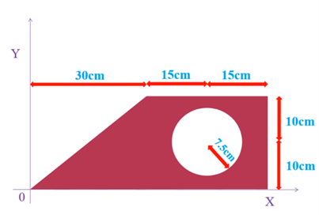
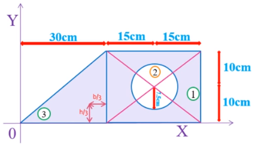
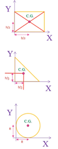
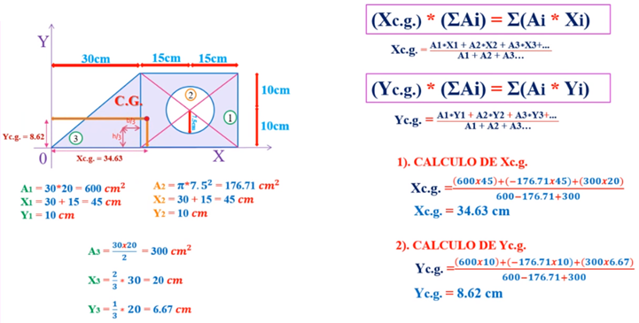

# Task: Clase, Herencia, Polimorfismo y Sobrecarga  
**course:** Programación Orientada a Objetos II  
**unit:** Fundamentos de Programación Orientada a Objetos  
**cmake project:** poo2_unit1_fundamentos_poo_v2021_2
## Instructions
Subir a gradescope los siguientes archivos:

- **`number.h` y `number.cpp`**, contienen la declaración (.h) y definición (.cpp) de la clase **`number_t`**
- **`search_odds.h` y `search_odds.cpp`**, contienen la declaración (.h) y definición (.cpp) de la función **`search_odds`**
- **`calculate_pentagon.h` y `calculate_pentagon.cpp`**, contienen la declaración (.h) y definición (.cpp) de la función **`calculate_pentagon`**
- **`quick_sort.h` y `quick_sort.cpp`**, contienen, contienen la declaración (.h) y definición (.cpp) de la clase **`quick_sort`** y de funciones adicionales de soporte.

## Exercise #1 - Clase number type (6 points)

Desarrollar la clase **`number_t`** que encapsule valores enteros (`tipo T`) que sin usar templates y desarrollar los siguientes métodos y operadores:
- constructor por default `number_t()`
- constructor por parámetros y operador de asignación por copia `number_t(const T& value)`, `number_t& operator=(const T& value)`.
- operador de incremento (`++`) y decremento (`--`) prefijo y postfijo
- operadores de adición/resta asignación (`+=`, `-=`)
- operadores de división/multiplicación asignación (`/=`, `*=`)
- operadores de potencia (`^`)
- operadores de potencia asignación (`^=`)
- operadores ostream `<<`
- operadores istream `>>`

**Use Case #1:**
```cpp
    number_t n1;
    cin >> n1;
    number_t n2{ 20 };
    number_t n3 = n1 + n2;
    number_t n4;
    number_t n5;
    const number_t n6 = n5;
    
    number_t* n7 = new number_t(5);
    number_t* n8 = new number_t;
    cin >> *n8;
    
    cout << n1 << endl;
    cout << n2 << endl;
    cout << n3 << endl;
    n4 = 10 + n3;
    cout << n4 << endl;
    n5 = n2 + n3;
    cout << n5 << endl;
    cout << n6 << endl;
    cout << *n7 << endl;
    cout << *n8 << endl;
    delete n8;
    delete n7;
```
**Use Case #2:**
```cpp
    number_t n1{ 10 };
    number_t n2{ 20 };
    number_t n3 = n1 + n2;
    number_t n4;
    number_t n5;
    cout << boolalpha;
    cout << (n2 >= n1) << endl;
    cout << (n2 <= n3) << endl;
    cout << (n2 > n1) << endl;
    cout << (n2 < n3) << endl;
    cout << (n3 == 30) << endl;
    n4 = 10 + n3;
    cout << (n4 != n3) << endl;
    cout << (n4 != 40) << endl;
    n5 = n2 + n3;
    cout << (n4 >= 40) << endl;
    cout << (n5 <= 50) << endl;
    cout << (n4 > 40) << endl;
    cout << (n5 < 50) << endl;
```

**Use Case #3:**
```cpp
    number_t n1;
    number_t n2;
    cin >> n1;
    cin >> n2;
    number_t n3 = 2;
    cout << (n2 / n1) << endl;
    cout << (n2 / 2) << endl;
    cout << (n2 ^ n3) << endl;
    cout << (n2 ^ 4) << endl;

    number_t n4 = n2 / n1;
    cout << n4 << endl;
    n4 += n2;
    cout << n4 << endl;
    n4 += 20;
    cout << n4 << endl;

    number_t n5 = n2 * n1;
    cout << n5 << endl;
    n5 /= n2;
    cout << n5 << endl;
    n5 /= 20;
    cout << n5 << endl;

    number_t n6 = 12;
    cout << n6 << endl;
    number_t n7 = 2;
    n6 ^= n7;
    cout << n6 << endl;
    n6 ^= 2;
    cout << n6 << endl;
```

## Exercise #2 - search odds (2 points)

Elaborar la función **`search_odds`** que tome como parámetro un vector de objetos del tipo **`number_t`** y retornar en un vector todos los números (**`number_t`**) que aparezcan en el vector una cantidad impar de veces.

**Use Case #1:**
```cpp
    auto r1 = search_odds({ 1, 1, 2, -2, 5, 2, 4, 4, -1, -2, 5 });
    cout << r1.front() << endl;     // -1

    auto r2 = search_odds({ 20, 1, 1, 2, 2, 3, 3, 5, 5, 4, 20, 4, 5 });
    cout << r2.front() << endl;     // 5
```

**Use Case #2:**
```cpp
    vector<number_t> vec;
    number_t value;
    while (cin >> value)
        vec.push_back(value);
    auto result = search_odds(vec);
    cout << result.front() << endl;
```

**Use Case #3:**
```cpp
    auto r = search_odds({ });
    if (!r.empty())
        cout << r.front() << endl;
    else
        cout << "vacio\n";
```

## Exercise #3 - calculate pentagon (2 points)

Elaborar la función **`calculate_pentagon`** que tome como parámetro un número positivo (**`n`**) y que calcule cuantos puntos existen en una figura pentagonal alrededor de un punto central en **`n`** iteraciones.  
En la imagen se puede ver que en la primera iteración (*`n = 1`*) solo se obtiene 1 punto, en la segunda (*`n = 2`*) se obtiene 6 y en la tercera (*`n = 3`*) se obtiene 31.
<p style="text-align:center">

</p>    

**Use Case #1:**
```cpp
    number_t x;
    cin >> x;
    cout << calculate_pentagon(x) << endl;
```

**Use Case #2:**
```cpp
    int val;
    vector<int> vec;
    while(cin >> val)
        vec.push_back(val);

    for (auto item: vec)
        cout << calculate_pentagon(item) << endl;
```

## Exercise #4 - quicksort (4 points)

Elaborar las funciones **`partition`** y **`quick_sort`** que implementen el algoritmo de ordenamiento **quick** en forma recursiva e implementar la clase **`quicksort_t`** basado en la función **`quick_sort`**, esta clase debe sobrecargar el operador `<<` para recibir el nombre del archivo, abrirlo y ordenarlo usando la función **`quick_sort`** (en el ejemplo el archivo se llama **in.txt**), ordenarlo y sobrecargar el operador **`>>`** que creara un archivo con el nombre de archivo descrito (en el ejemplo **out.txt**) y grabará el contenido del archivo **in.txt** ordenado.

Ejemplo:  
```
    quicksort_t qs;
    qs << "in.txt";
    qs >> "out.txt";  
```

**Use Case #1:**
```cpp
    quicksort_t qs = { 10, 4, 1, 3, 7, 8, -4, -3, 100, 2, 9};
    cout << qs << endl;
```

**Use Case #2:**
```cpp
    {
        quicksort_t qs;
        qs << "in_4_4.txt";
        qs >> "out_4_4.txt";
    }
    ifstream file("out_4_4.txt");
    
    int value = 0;
    while (file >> value)
        cout << value << " ";
    cout << endl;
```

## Exercise #5 - Figura Compuesta (6 points)

Implementar un programa orientado a objetos que permita calcular el centro de gravedad o centroide de un área plana compuesta como la que se muestra a continuación.



Considere que el área esta compuesta por un triángulo, un rectángulo y un círculo.



Los centroides de las figuras mencionadas se obtienen de la siguiente manera:



Adicionalmente se incluye los cálculos que deberían ser considerados para este ejemplo.



**Use Case:**  
```cpp
    figura_compuesta_t fc;
    fc.add<triangle_t>(0, 0, 30, 20, vside::right, hside::top);
    fc.add<rectangle_t>(30, 0, 30, 20);
    fc.extract<circle_t>(45, 10, 7.5);
    
    auto centroid = fc.get_centroid();
    cout << centroid.x << " " << centroid.y << endl;
```

